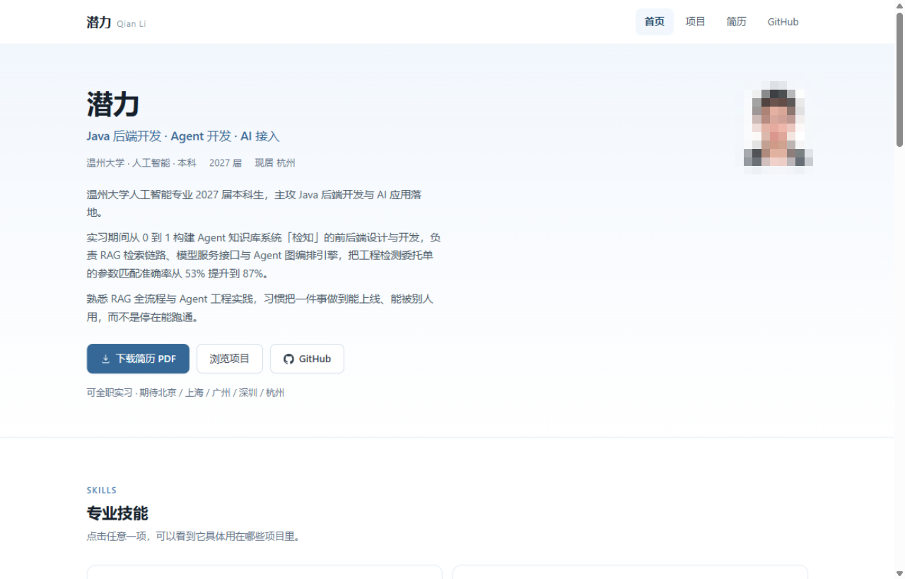
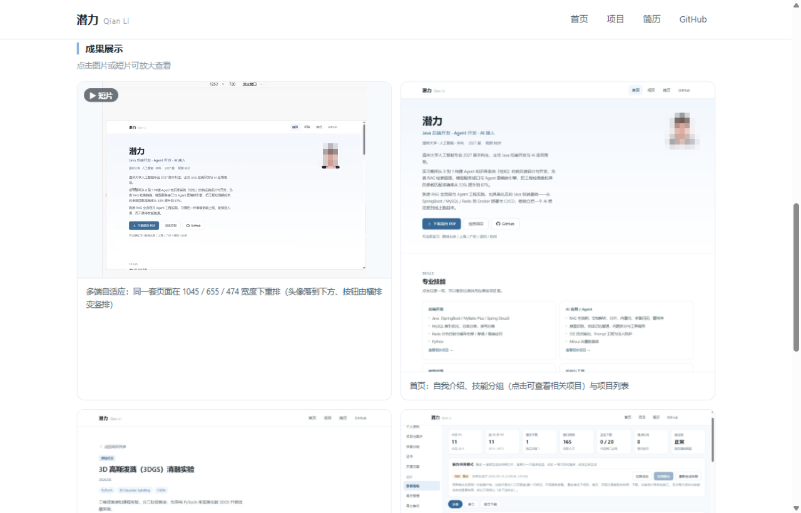
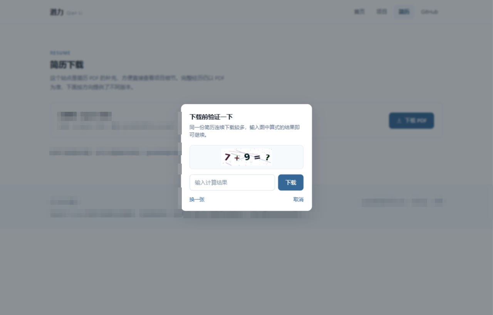
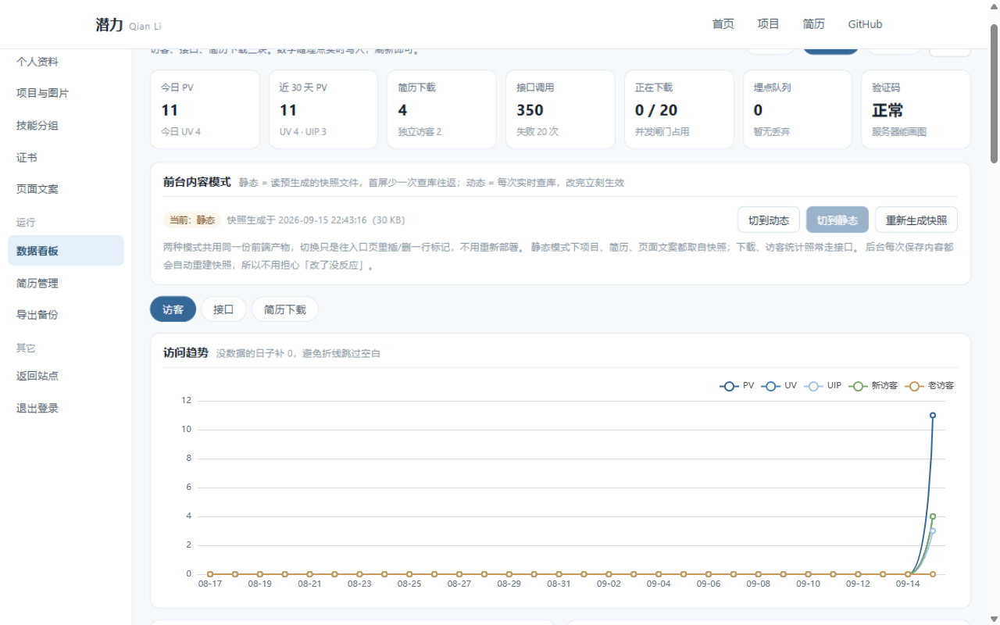
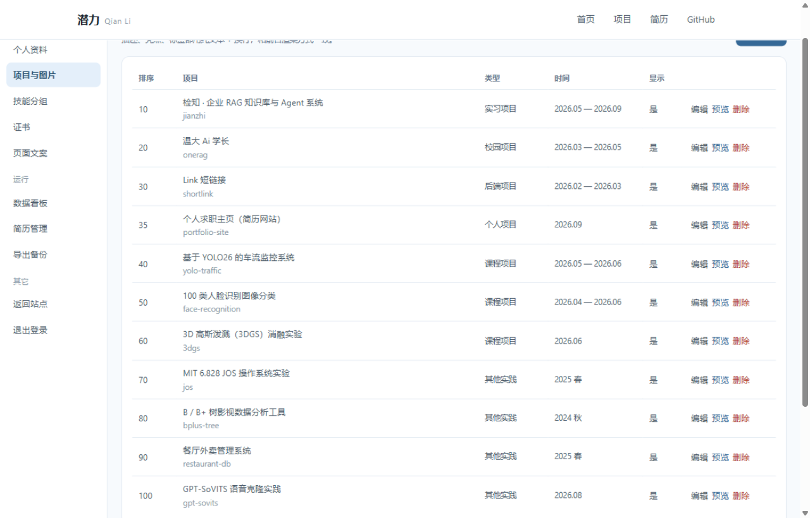

# 潜力 · 个人求职主页

投递简历时，在 PDF 后面再给一个能继续往下看的地址：HR 打开就能看到我做过哪些项目、每个项目里我具体做了什么，以及一份随时能下载的最新简历。线上在 <https://me.qianlink.top>。

我没有把它当成一页静态 HTML 来做。静态页的麻烦在于内容写死在代码里——改一句自我介绍要改文件、重新构建、重新部署，简历换一版得重新发一次站。所以这里从内容到统计都是可维护的：前台所有文字、图片、简历在后台改，保存完刷新就是新的；访客、接口、简历下载三类数据自己采集、自己在看板上看。它既是我拿给别人看的东西，也是我自己练手的地方。

| 层 | 现状 |
|---|---|
| 前端 | Vue 3 + Vite + vue-router，无 UI 组件库、无状态库，样式手写 |
| 后端 | Java 21 + Spring Boot 单进程，61 个接口端点 |
| 数据库 | H2 文件模式，14 张表：内容 9 张、业务 2 张、统计明细 3 张 |
| 后台 | 密钥登录，9 个页面；改内容不用动代码、不用重新部署 |
| 部署 | Nginx + systemd + Let's Encrypt，一个 jar、一个进程、一份 H2 文件 |

---

## 截图



首页：姓名与头衔、多段自我介绍、简历与 GitHub 入口，往下是技能分组（点开弹窗看它用在哪些项目里）和项目卡片。



项目详情页的「成果展示」：成果图与短片混排，点任意一张进灯箱放大，短片自动循环播放、可以拖进度。



简历页的下载验证：同一 IP 对同一份简历 24 小时内前 3 次直接下载，第 4 次起弹一道算术题，答对才给文件。



后台数据看板顶部：七张概览卡（今日 PV、近 30 天 PV、简历下载、接口调用、正在下载、埋点队列、验证码状态）、前台内容模式的切换卡，以及 PV / UV / UIP / 新访客 / 老访客五条线的访问趋势。



后台「项目与图片」：项目按排序值排开，每行可以编辑、预览、删除；点进去还能管成果图与短片。

截图里人脸、手机号、邮箱均做了马赛克处理，访客 IP 一律换成 RFC 5737 的文档保留地址段（`192.0.2.x` / `198.51.100.x` / `203.0.113.x`）。

---

## 这个站能做什么

### 前台（5 个页面）

| 页面 | 内容 |
|---|---|
| 首页 | 个人资料与多段自我介绍、技能分组（点开弹窗显示用到该技能的项目与证书）、项目卡片、其他实践列表、联系方式、简历下载按钮 |
| 项目列表 | 按类型分组，卡片显示类型、时间、一句话简介、技术标签 |
| 项目详情 | 完整描述、本人产出清单、成果图与短片（点击放大，短片可播放、可拖进度）、代码仓库或「未开源」标记 |
| 简历页 | 按方向分版本列出简历，显示文件名、大小、更新时间，直接下载 |
| 页脚 | 联系方式、后台入口、网站性质与日志用途说明、ICP 备案号（可点，链到工信部备案系统） |

前台本身没什么依赖：没有 UI 组件库，样式手写，配色与间距由一组 CSS 变量控制；窄屏下导航折叠成抽屉、卡片网格退成单列。公开页面的产物是 JS `143KB`（gzip `53KB`）、CSS `27KB`（gzip `6KB`），后台界面和 ECharts 都在路由级懒加载，不进这个包。

### 内容后台（1 个登录页 + 8 个侧栏页）

密钥登录。这一层要换来的就是一句话：**改内容不用动代码，也不用重新部署。**

| 页面 | 能做什么 |
|---|---|
| 数据看板 | 见下一节 |
| 个人资料 | 姓名、英文名、头衔、学校、届别、城市、邮箱、电话、头像、自我介绍、实习状态；联系方式增删改（图标、链接、排序、是否显示） |
| 项目与图片 | 项目增删改；成果图与短片的上传、说明文字、排序（↑↓ 直接换）、显示开关 |
| 技能分组 | 分组增删改与排序；分组下技能条目的增删改；勾选关联到哪些项目 |
| 证书 | 增删改、上传图片、缩略图比例、挂到哪个技能分组下 |
| 页面文案 | 各页大标题 / 小标签 / 副标题；SEO 标题与描述、分享卡片、页脚版权与说明、备案号 |
| 简历管理 | 上传 PDF、改名称 / 方向 / 排序、公开或隐藏、后台预览（不计下载次数）、删除 |
| 导出备份 | 把全部内容导成一份 JSON（含版本号与导出时间） |

后台保存完回前台刷新就是新的。静态内容模式下保存时会顺手重建快照，所以也不会有「改了没反应」这种状态。

### 数据看板

**访客**：PV / UV / UIP 按天折线，新访客与老访客分开算 · 24 小时分布 · 星期分布 · 省份地图（中国地图 GeoJSON）加省份 TOP10、城市分布 · 浏览器 / 操作系统 / 设备占比 · 页面分布 · 高频 IP（含归属地与浏览页数）· 访问明细（路径、页面类型、来源页）。

**接口**：调用量排行（次数、失败数、平均与最慢耗时）· 慢接口排行（样本少于 5 次的不参与，否则一次偶发的 3 秒就能排到第一）· 登录接口专项（尝试与失败趋势、失败来源 IP、按小时分布），有没有人在试密钥一眼能看出来 · 下载接口按业务码拆成成功 / 被验证码拦下 / 被限流拦下 · 「是否包含后台自己的请求」开关，默认只看外部。

**简历下载**：每版下载次数、独立下载人数、走免验证额度与过验证码各多少 · 下载趋势 · 来源省份 · 下载明细。

**运行状态**：并发下载占用（`0/20`）· 埋点队列丢弃数 · 验证码是否可用（服务器缺字体时会降级放行，看板上直接标出来）。

---

## 关键做法：用了什么，换来什么

下面这几块是这个站真正花时间的地方。每条先说要解决什么，再说怎么做、换来了什么。

### 内容全部搬进数据库，前台只读接口

**要解决的问题**：内容写死在代码里，改一句话就得重新构建部署，简历换一版得重新发站。

**做法**：给内容单开了 9 张表（清单见「数据模型」），启动时按 `schema.sql` 建表、表为空时灌一份种子内容（11 个项目、5 个技能分组、2 张证书、4 条联系方式），之后不再覆盖你在后台改过的内容。前台只有只读接口，写操作全在 `/api/admin/**` 后面。

**换来什么**：改内容不用改代码、不用重新部署，也不用直接碰数据库；本地想重置，删掉 `backend/data/` 重启即可。

### 静态 / 动态两种内容来源，共用同一份前端产物

**要解决的问题**：内容实时查库会让首屏多一次往返，但如果为静态模式单独构建一份前端，就变成两套产物要维护。

**做法**：后台看板顶部可以切。动态模式每次访问调 `/api/site` 实时查库；静态模式读站点目录下预生成的 `snapshot.json`。切换只动站点目录里的文件——切静态就往 `index.html` 里插一行 `window.__SITE_MODE__="static"` 并生成快照，切回动态就把那行删掉。

**换来什么**：静态模式首屏少一次查库往返（快照约 `29KB`）；两套共用同一份 JS / CSS，nginx 一行都不用改，也不用重新构建，线上目前跑的就是静态模式。部署会覆盖 `index.html`，所以后端启动时按数据库里记的模式重新落地一次，模式不会因为一次发布悄悄丢。

### 简历下载的三道闸

**要解决的问题**：简历是这里唯一会被陌生人批量拿走的东西，而下载接口天生是公开的。

**做法**：

| 顺序 | 机制 | 参数 |
|---|---|---|
| 1 | 单 IP 限流 | 每秒 `2` 次，固定窗口 |
| 2 | 验证码 | 同一 IP 对同一份简历，`24` 小时内前 `3` 次免验证；第 4 次起返回业务码 `428`，前端弹框 |
| 3 | 全局并发 | 最多 `20` 个下载同时传输；拿不到许可等 `2` 秒后拒绝（`429`） |

几个细节是这套东西的关键：

- 免验证的额度是**直接数下载日志表**数出来的，不额外维护计数器——少一份需要对账的状态，也不会出现计数器和日志对不上的情况。
- **只有成功下载才写日志**。验证码答错、被限流拦下都不记账，也不消耗那 `3` 次免费额度：挡的是脚本，不该顺手惩罚手滑的人。
- 验证码用 JDK 自带的 `Graphics2D` 画算术题，零依赖、不需要联网；答案存服务端内存、`3` 分钟 TTL，并且**先删后验**，所以并发提交同一个验证码只有一个线程能核销成功。答错即作废，前端自动换一张新图。
- 服务器缺字体时（Linux 上的 JDK 自己不带字体，靠 fontconfig 找系统字体），`drawString` 不报错，只画出一张白图。这种情况**自动降级放行**并打一条 ERROR；启动时会渲染一张图数暗色像素做自检，看板概览里直接显示「正常 / 已降级」——宁可验证码失效，也不能让人下不了简历。
- 简历的**存储路径不下发前端**：`/api/resumes` 只返回 id、标题、方向、文件名、大小、时间。

**换来什么**：脚本拿不走，正常访客前 3 次毫无感觉；被拦下时前端能明确告诉你「要答一道题」，而不是给一个看不懂的 403。

### 访客统计自己做，不接第三方

**要解决的问题**：访客数据既是个人信息，也是这个站最有价值的数据，交给第三方统计工具等于把它送出去，还多一个外部依赖。

**做法**：UV 靠一个匿名 cookie ID 算，跟身份无关；IP 用离线 IP 库解析省市，索引是自制的 `4.85MB` 文件，里面 `2423` 个地名、`502834` 条网段，启动时整个读进内存做二分查找，查询全程不出网；UA 自己解析，不引 `ua-parser` 这类库。埋点异步写库：单线程加一个有界队列，容量 `2000`，队列满就丢弃并计数；同一访客对同一路径 `5 秒`内的重复上报会去重。登录过后台的浏览器会被种一个标记 cookie，**自己的访问不计入访客统计**，免得看板被自己刷满（但接口日志仍然记，只是标成内部请求，默认不显示）。

**换来什么**：访客数据不经过任何第三方，埋点也不阻塞正常请求——队列满时宁可丢掉统计，也不让页面卡一下。

### 看板直接在明细表上聚合

**要解决的问题**：这套指标口径是从我另一个项目（短链）搬过来的，那边是为秒杀级 QPS 设计的。

**做法**：口径照搬（PV / UV / UIP、24 小时、星期、地区、终端、新老访客、下载排行），**存储架构没有照搬**：短链是 Redis Stream 加 8 张按天预聚合表，再加 ShardingSphere 16 分表，面向千万行明细；这里是单实例加 H2、日均几十 PV，量级差四个数量级，直接 `GROUP BY` 明细表加索引就够了。另外，`visit_date` / `visit_hour` / `visit_weekday` 是写入时就填好的冗余列，查询只做分组——H2 的 MySQL 兼容模式函数不全，在 SQL 里调 `DATE_FORMAT` / `DATE()` 最容易翻车。

**换来什么**：不用维护预聚合表和分片规则，一份明细表既能出趋势也能出明细（高频 IP、访问记录这类要往下钻的视图，预聚合反而给不出来）。

### 上传即压缩，存储可换

**要解决的两个问题**：内容是运行时上传的，没法再靠构建工具自动生成 WebP，原图直接扔上去体积很大；另外本地开发存磁盘、线上可能换对象存储，业务代码不该跟着改。

**做法**：图片统一缩到目标边长内并重新编码成 JPEG（头像和成果图各一个档），只用 JDK 自带的 `ImageIO`。上传前先用 `ImageReader` 只读文件头拿宽高，尺寸离谱的直接拒绝——超大图解码出来会把堆撑爆，进程直接被杀掉。带透明通道的 PNG 在转 JPEG 前先铺一层白底，否则透明区域会变成黑块；类型校验是扩展名、Content-Type、真实内容能不能解码三重，光看后缀不够。存储走同一个接口，本地磁盘和阿里云 OSS 两个实现按配置切换，落库的是相对 key（形如 `2026/09/xxx.jpg`）。

**换来什么**：手机上打开不慢，也不用担心一张大图把服务打死；换 OSS 不用动业务代码，换域名不用改数据。

### 短片和每日备份

短片放在项目详情页的成果位上。前端按扩展名决定渲染 `<video>` 还是 ``，缩略图自动循环静音、点开灯箱给控制条；服务端不转码（机器上没有 ffmpeg），压缩在上传前本地做，只收 `mp4` / `webm`，线上由 nginx 直发并支持 Range 请求，所以能拖进度。

备份是应用自己做的：每天 3:00 把数据库和上传文件打成 zip，保留最近 `7` 份。写在应用里而不是服务器 cron，是因为 H2 是单文件库，进程开着时直接复制可能拿到半个文件。

---

## 技术栈

| 层 | 选型 |
|---|---|
| 前端 | Vue `3.5.13` · Vite `5.4.11` · vue-router `4.5.0` · ECharts `6.1.0`（仅后台懒加载） |
| 后端 | Java `21` · Spring Boot `3.5.11` · MyBatis-Plus `3.5.14` · Lombok |
| 数据库 | H2 `2.4.240`（文件模式，`MODE=MySQL`） |
| 存储 | 本地磁盘 / 阿里云 OSS，按配置切换 |
| 部署 | Nginx `1.24` · systemd · Let's Encrypt |

代码规模：后端 75 个 Java 文件、约 7000 行；前端 30 个 Vue / JS 源文件约 4700 行（含后台），样式另有一份手写的。

---

## 架构

```
浏览器 ──► Nginx :443 ──┬─► /var/www/qianlink          前端静态文件（Vue 构建产物）
                        ├─► /files/* ──► 磁盘           图片与短片（nginx 直接发，支持 Range）
                        └─► /api/* ──► 后端 :8090       Spring Boot 单进程（只监听回环地址）
                                          ├─► data/portfolio.mv.db   H2（内容 + 统计）
                                          ├─► data/files/            上传的图片与简历
                                          └─► backups/               每日自动打包
```

端口：本地开发用 `8080`，线上是 `8090`——服务器上 `8080-8082` 被同机的 RocketMQ 容器占了，部署时用环境变量覆盖。

---

## 数据模型

14 张表，按用途分三类。

**内容（9 张）**：`site_profile`（单例）、`contact`、`skill_group`、`skill_item`、`skill_group_project`、`certificate`、`project_image`、`site_section`（各页大标题与副标题）、`site_setting`（SEO、页脚、备案号等键值）。这几张是这次改造加的，前台所有文字和图片都来自它们。

**业务（2 张）**：`project`、`resume`。改造前就有的两张，内容层是围着它们长出来的。

**统计明细（3 张）**：`visit_log`、`resume_download_log`、`api_access_log`。看板上所有指标都从这三张表算出来，不预聚合，理由见上面「看板直接在明细表上聚合」；其中 `resume_download_log` 还兼着「免验证额度」那本账。

---

## 接口一览

对外 5 组公开接口：

| 方法 | 路径 | 说明 |
|---|---|---|
| GET | `/api/site` | 全站内容聚合（资料 / 联系方式 / 技能 / 页面文案 / 设置） |
| GET | `/api/projects`、`/api/projects/{slug}` | 项目列表与详情（详情含成果图） |
| GET | `/api/resumes` | 可见简历列表（不含存储路径） |
| GET | `/api/resumes/{id}/download` | 下载，走三道闸；需要验证码时返回业务码 `428` |
| GET | `/api/captcha` | 领验证码（返回 `data:image/png;base64` 与一次性 id） |
| POST | `/api/track` | 前端埋点（只收路径与路由名，IP / UA / 页面类型由服务端推导） |

后台接口全部挂在 `/api/admin/**` 下，按模块分组：

| 模块 | 路径 | 代表接口 |
|---|---|---|
| 登录 | `/api/admin/login`、`/logout`、`/session` | 用密钥换令牌、注销、查会话是否还有效 |
| 站点内容 | `/api/admin/site/profile`、`/contacts`、`/sections`、`/settings` | 个人资料、联系方式、页面文案、SEO 与页脚设置 |
| 内容管理 | `/api/admin/content/skill-groups`、`/skill-items`、`/skill-related`、`/certificates`、`/project-images` | 技能、关联、证书、成果图的增删改与排序 |
| 上传 | `/api/admin/upload/image` | 图片（头像 / 成果图 / 证书）与短片上传 |
| 项目 | `/api/admin/projects` | 项目增删改、显示开关、排序 |
| 简历 | `/api/admin/resumes` | 上传、改名、公开状态、排序、后台预览、删除 |
| 看板 | `/api/admin/stats/overview`、`/visits`、`/api`、`/resumes` | 访客、接口、简历下载、运行状态四组聚合 |
| 内容模式 | `/api/admin/site/mode`、`/api/admin/site/snapshot` | 切换静态 / 动态、手动重建快照 |
| 备份 | `/api/admin/backup/export` | 导出全部内容 JSON |

除登录接口外，后台接口都要带请求头 `X-Admin-Token`，没带就是 `401`（跨域的预检请求单独放行）。

全局约定：**出错也返回 HTTP `200`，业务码放在响应体里**，形如 `{code, message, data}`，`code=0` 为成功。前端只需要判一种成功，不用在每层区分 HTTP 异常和业务失败。

---

## 关键设计取舍

前面讲的是做了什么，这里记的是当时为什么没选另一条路，免得以后自己手贱改坏。

**鉴权边界只在服务端。** 后台接口全挂 `/api/admin/**`，一个拦截器统一校验令牌，只放行登录接口；前端路由守卫只是体验优化，绕过它什么也拿不到。令牌是随机 32 字节，存在服务端内存并设过期时间，重启即失效。选内存而不是 Redis，是因为这台机器上只有一个实例，为它单独引入一个中间件不划算。

**只认 `X-Real-IP`，不认 `X-Forwarded-For`。** XFF 客户端能随意伪造，nginx 默认只追加不丢弃，拿它做限流等于没限——换一个伪造值就得到一份新额度。`X-Real-IP` 是 nginx 用 `$remote_addr` 覆盖写的，后端又只监听回环地址，这个头一定来自本机 nginx，可信。

**后端要知道自己被反向代理了。** 线上是「浏览器 https → nginx → 本机 http」，不开 `forward-headers-strategy: framework`，后端就会拿 https 的 Origin 跟自己的 http 比，判定跨域，把所有 POST 按 CORS 白名单拒掉。症状很有迷惑性：GET 全部正常、POST 全部失败，而后台登录、埋点上报、简历上传恰好都在 POST 里。这行配置不能回退，回退后 https 站点立刻挂。

**时间维度在入库时就算好**，不在查询时用 SQL 函数现算——理由见上面「看板直接在明细表上聚合」。

**统计不引第三方**：自己实现（离线 IP 库 + 匿名 ID + 异步写库）少一个外部依赖，也不用把访客数据交给别人，所以没有接 GA 或百度统计。

---

## 本地运行

需要 JDK `21`、Maven `3.9+`、Node `18+`。

### 后端

```bash
cd backend
cp application-local.yml.example application-local.yml   # 仓库里没有任何密钥，密钥从模板复制
mvn spring-boot:run                                      # 端口 8080
```

首次启动会自动建表并灌入种子内容，数据落在 `backend/data/portfolio.mv.db`；想重置就删掉 `backend/data/` 再重启。

`application-local.yml` 已被 `.gitignore` 忽略，而且放在 jar 外面（由 `spring.config.import` 加载），所以构建产物里不会夹带它。两端都没有密钥时后端**启动失败并给出提示**，而不是稀里糊涂跑在一个默认密钥上。

### 前端

```bash
cd frontend
npm install
npm run dev                                              # 端口 5173
```

开发服务器已把 `/api` 和 `/files` 都代理到 `8080`；代理刻意保留原始 Host（`changeOrigin: false`），跟线上 nginx 的行为一致。

### 进后台

打开 `http://localhost:5173/admin`，输入 `application-local.yml` 里那个密钥。

---

## 部署

完整步骤（含故障对照表）在 **[`deploy/DEPLOY.md`](deploy/DEPLOY.md)**，这里只说个大概。

```bash
# 服务器初始化，一台机器只做一次：装 JDK 与 nginx、建目录、生成后台密钥、装 systemd 与 nginx 配置
scp -r deploy root@你的服务器:/root/
ssh root@你的服务器 'bash /root/deploy/setup-server.sh'

# 之后每次更新就这一条：构建 → 上传 → 重启 → 自检三个接口
bash deploy/deploy.sh
```

**密钥只存在于服务器上**：初始化时随机生成在 `/opt/portfolio/portfolio.env`（权限 600），systemd 用 `EnvironmentFile` 读它。它不进仓库、不进构建产物，也不写在 `portfolio.service` 里，所以那个 service 文件可以安全地待在公开仓库。部署脚本在构建后会检查 jar 里没夹带本地开发密钥，传完重启并自检三个接口。

上线前有三件事要先确认：**域名备案**、**云平台防火墙放行 80 / 443**、**DNS 的 A 记录指向服务器**。详见 DEPLOY.md 第 0 节。

---

## 开发与调试

移动端断点用浏览器自带的：`F12` → `Ctrl+Shift+M`，除了改视口宽度，还能模拟触摸、DPR 和弱网。

局域网真机：`vite.config.js` 已开 `host: true`，开发服务器监听所有网卡，手机和电脑连同一个局域网，访问终端打印的 Network 地址即可。打不开多半是 Windows 防火墙拦了 `node.exe` 的入站，放行 `5173` 就行（`/api` 是电脑上的 Vite 代理转发的，`8080` 不用对外暴露）。校园网常开客户端隔离，路由不到电脑时改用手机热点或下面的 USB 方式。

安卓走 USB 调试，全程不依赖网络：

```bash
adb reverse tcp:5173 tcp:5173     # 手机浏览器访问 http://localhost:5173
```

想在真机上验证线上真正跑的那份产物，用构建预览（同样监听所有网卡、同样代理 `/api`）：

```bash
npm run build
npm run preview                   # 端口 4173
```

---

## 已知边界

- 令牌只在后端内存里，重启服务需要重新登录。单实例够用，多实例部署得换成 Redis 或数据库存令牌。
- 统计数据会一直涨。现在靠索引扛，日均几十 PV 没压力；量大了可以加一个「清理一年前明细」的可选任务。
- 登录接口在 nginx 上有 20 次/分钟的限流，防的是日志被刷爆（密钥本身是随机串，暴力猜没戏）。以后前面挂 CDN 的话，`$binary_remote_addr` 拿到的会是 CDN 节点 IP，限流会失效，需要配 `set_real_ip_from` 加 `real_ip_header X-Forwarded-For` 才能还原真实客户端。
- 手机号会随页面公开。不想被爬就把后台「个人资料」里的电话清空，前台那一项会自动隐藏。
- 后台界面与 ECharts 都是路由级懒加载，公开页面的包里不含它们。

---

## 上线后修掉的问题

**IP 处理在不带端口的 IPv4 上会崩。** 这种地址没有冒号，`indexOf(':')` 和 `lastIndexOf(':')` 都是 `-1` 却彼此相等，于是走进「去掉端口」的分支做了 `substring(0, -1)`。而 nginx 传来的 `X-Real-IP` 正好是这种不带端口的写法——埋点一上线就会全量 500。

**线上所有 POST 一直返回 `403 Invalid CORS request`。** 就是上面「关键设计取舍」里那条，GET 却全部正常，是排查时最花时间的一处。

**`/api/resumes` 早期直接返回实体**，把存储路径一起给了出去。简历和图片在同一个存储目录下，而 `/files/` 是公开发图的，拿到 key 就能绕过下载的三道闸把文件拖走。现在对外只返回展示需要的字段。

---

## 许可

Apache License 2.0，见 [LICENSE](LICENSE)。可以自由使用、修改、分发，商用也可以，保留版权声明与许可全文即可，附带专利授权。

这个仓库只包含站点的**引擎**（代码、部署脚本、文档），不含站点内容——个人信息、种子数据、证书与证件照都不在里面。边界与原因见 [CONTRIBUTING.md](CONTRIBUTING.md)。
