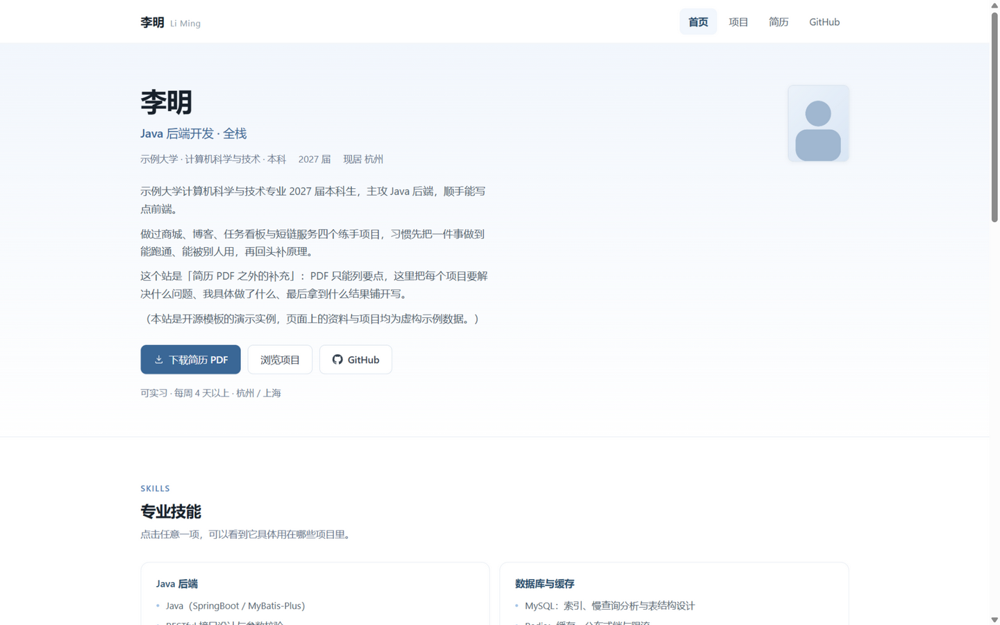
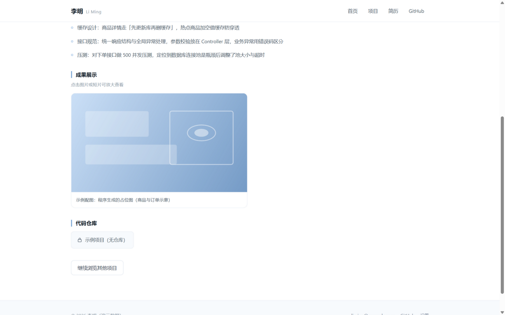
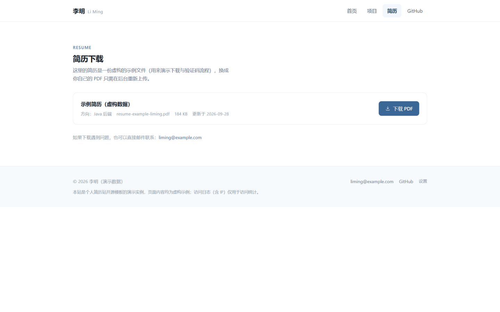
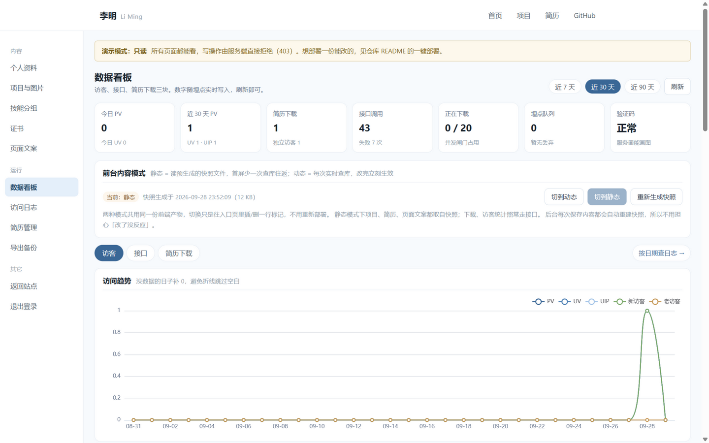
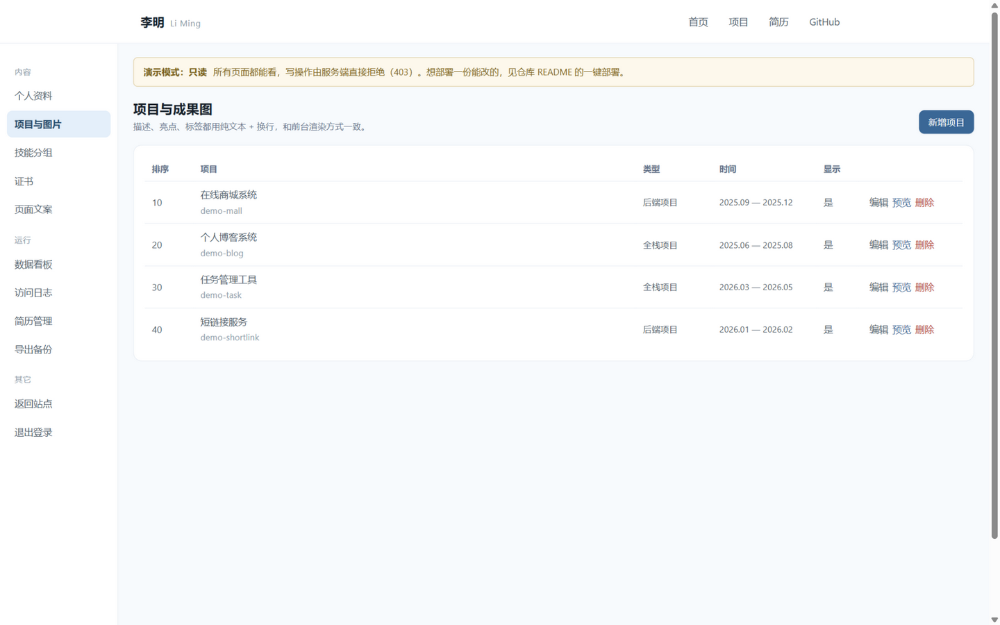

# 个人简历站（demo 版）

给正在求职的同学：简历 PDF 篇幅有限，只能列要点——把它变成「**一份 PDF + 一个能继续往下看的地址**」，
HR 打开链接就能看到你做过哪些项目、每个项目里你具体做了什么，以及一份随时能下载的最新简历。

这是一个可以直接部署的开源模板：前台展示、内容后台、访问统计都是现成的，部署完进后台录入自己的内容，不用改代码、不用重新构建。

- **在线 demo**：<https://profile.qianlink.top>（示例数据均为虚构；后台演示密钥 `demo`，登录后所有页面都能看，写操作由服务端拒绝）
- **一键部署**：Docker Compose，三条命令起服务
- **技术栈**：Vue 3 + Vite · Java 21 + Spring Boot · H2（文件模式）· Nginx

## 截图（全部来自在线 demo）



首页：自我介绍、技能分组（点开能看它用在哪些项目里）与项目卡片。



项目详情页：要解决什么、具体做了什么、结果如何，配成果图（点开放大，也支持短片）。



简历页：按方向列出简历，直接下载 PDF。



后台数据看板：访客（PV / UV / UIP、地区、终端、页面分布、项目关注度）、接口调用、简历下载三块，外加运行状态与静态 / 动态内容模式切换。



后台「项目与成果图」：项目增删改、排序、显示开关；资料、技能、证书、页面文案、简历各有独立页面，改完回前台刷新即生效。

## 功能一览

| 模块 | 能做什么 |
|---|---|
| 前台（5 个页面） | 首页、项目列表与详情、简历下载、页脚；无 UI 组件库、无状态库，样式手写，窄屏自适应 |
| 内容后台 | 密钥登录；个人资料 / 联系方式 / 技能 / 证书 / 项目与成果图 / 页面文案 / 简历 / 备份导出，改内容不用动代码 |
| 数据看板 | 访客（PV / UV / UIP、24 小时与星期分布、省市地图、终端、项目关注度）、接口（调用量、慢接口、登录专项）、简历下载、运行状态 |
| 下载保护 | 单 IP 限流 → 同 IP 对同一份简历 24 小时内前 3 次免验证、之后要答对一道算术题 → 全局并发上限；被拦不记账、不消耗免费额度 |
| 统计自建 | 匿名 cookie 算 UV、离线 IP 库解析省市（查询不出网）、埋点异步写库，不接任何第三方统计 |
| 演示模式 | 一个开关把后台变成只读（写操作服务端直接拒绝），把站当 demo 挂出去给别人点 |

## 一键部署（Docker Compose）

在一台装了 Docker 的机器上：

```bash
git clone https://github.com/yanjinpijiu/portfolio-site.git
cd portfolio-site
cp .env.example .env     # 把后台密钥改成你自己的（必填），其余按需
docker compose up -d     # 首次构建要几分钟
```

访问 `http://<你的服务器IP>:8080`，后台在 `/admin`，用你在 `.env` 里设的密钥登录。
数据在 `./data`（H2 库 + 上传的文件）、备份在 `./backups`，容器重建不丢。

> 构建是三段式（前端 npm → 后端 Maven → JRE 运行镜像），第一次要拉镜像和依赖，
> 之后改代码重建会快很多。

### 挂上自己的域名 + HTTPS

推荐外层再放一个 nginx：监听 80/443、用 certbot 签证书，`proxy_pass` 到应用端口；
同时把 compose 里的端口映射改成**只绑本机回环**（写法见 `docker-compose.yml` 的注释），
不把应用端口直接暴露到公网。`deploy/` 里有一份可以直接抄的 nginx 配置。

## 本地开发

需要 JDK 21、Maven 3.9+、Node 18+。

```bash
# 后端（8080）
cd backend
cp application-local.yml.example application-local.yml   # 填一个本地开发密钥
mvn spring-boot:run

# 前端（5173，/api 已代理到 8080）
cd frontend
npm install
npm run dev
```

首次启动自动建表；站点内容是空的——进后台录入，或者仿照 `DemoContentSeeder` 写一个自己的种子类。

## 换成自己的内容

1. **后台直接改（推荐）**：逐页录入，保存后前台刷新即生效；静态模式下会自动重建快照，不会有「改了没反应」。
2. **写一个 Seeder**：仿照 `backend/src/main/java/com/example/portfolio/config/DemoContentSeeder.java`，
   各表判空再灌，不会覆盖你改过的内容。

想挂一个只读演示站给别人看：`.env` 里把演示模式设成 `true`，后台就只能看不能改（写操作 403），
再配一个提示值让登录页显示演示密钥。两个变量的说明都在 `.env.example` 里。

## 代码里值得看的几处

- **下载的三道闸**：`guard/DownloadGate`——单 IP 限流、免验证额度直接数下载日志表（不额外维护计数器）、
  全局并发许可挂在 `InputStream.close()` 上而不是 Controller 的 finally（放早了闸门就形同虚设）。
- **拦截器的顺序是有意排的**：`config/WebConfig`——埋点必须在鉴权之前，
  否则鉴权失败的越权尝试一条都记不下来。
- **统计不引第三方**：`stats/`——离线 IP 库启动时整个读进内存做二分查找，查询不出网；
  埋点走单线程有界队列，满了丢弃并计数，绝不阻塞正常请求。
- **静态 / 动态两种内容来源共用同一份前端产物**：`service/SiteSnapshotService`——
  切换只是往 `index.html` 插 / 删一行标记并生成快照，nginx 与构建流程都不用改。
- **演示模式的安全边界在服务端**：`config/DemoReadOnlyInterceptor`——前端把按钮置灰只是体验，
  直接发请求也一样被拒。

## 技术栈与结构

| 层 | 选型 |
|---|---|
| 前端 | Vue 3 · Vite · vue-router · ECharts（仅后台懒加载，不进公开页面的包） |
| 后端 | Java 21 · Spring Boot · MyBatis-Plus · Lombok |
| 数据库 | H2（文件模式，`MODE=MySQL`），15 张表 |
| 存储 | 本地磁盘 / 阿里云 OSS，按配置切换，业务代码不改 |
| 部署 | Docker Compose（单容器），或 Nginx + systemd（见 `deploy/`） |

规模：后端 82 个 Java 文件、65 个接口端点；前端 32 个源文件。

```
浏览器 ──► Nginx ──┬─► 前端静态文件（Vue 构建产物）
                   ├─► /files/* ──► 磁盘        上传的图片与简历（nginx 直发）
                   └─► /api/* ──► Spring Boot    只监听回环地址
                                   ├─► data/portfolio.mv.db   H2（内容 + 统计）
                                   └─► data/files/            上传的文件
```

## 裸机部署（不用 Docker）

完整步骤（服务器初始化、更新发布、故障对照表）在 **[deploy/DEPLOY.md](deploy/DEPLOY.md)**：
`setup-server.sh` 装 JDK / nginx / 字体并生成一个随机后台密钥，之后每次更新一条命令。
密钥只存在于服务器的 env 文件里，不进仓库、不进构建产物。

## 已知边界

- 令牌存在后端内存里，重启后要重新登录；要横向扩得多实例，就得先把令牌挪进 Redis。
- 统计明细会一直涨，现在靠索引扛；量大后可以加一个「清理一年前明细」的可选任务。
- 下载验证码靠服务端字体渲染：Linux 上要装 fontconfig 和字体（`setup-server.sh` 已处理），
  缺字体时验证码自动降级放行并在看板上标出来，不会让人下不了简历。
- **Docker 构建的前端阶段对内存有要求**：前端打包内含约 20MB 的省市地图 GeoJSON，
  Vite 构建峰值约 1.5GB Node 堆——构建机可用内存不足 2GB 时这一阶段会失败（后端阶段不受影响）。
  小内存机器可以本地构建前端（`npm run build`）后走 `deploy/` 裸机部署路径。

## 许可

Apache License 2.0，见 [LICENSE](LICENSE)。这个仓库只包含站点的「引擎」——不含任何真实个人信息、
种子内容与密钥，示例数据均为虚构。参与约定见 [CONTRIBUTING.md](CONTRIBUTING.md)。
